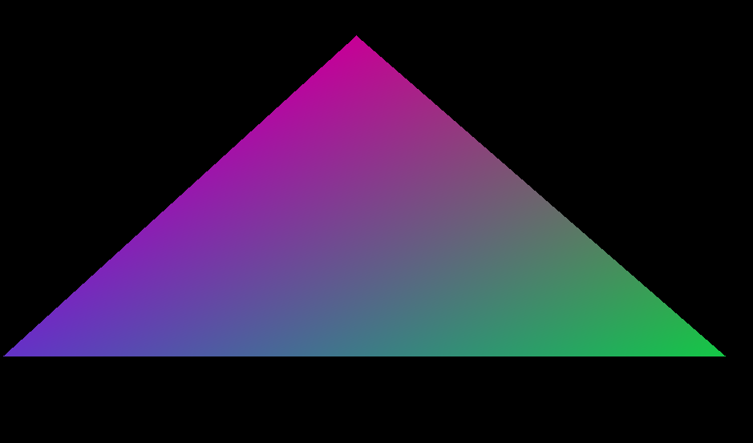
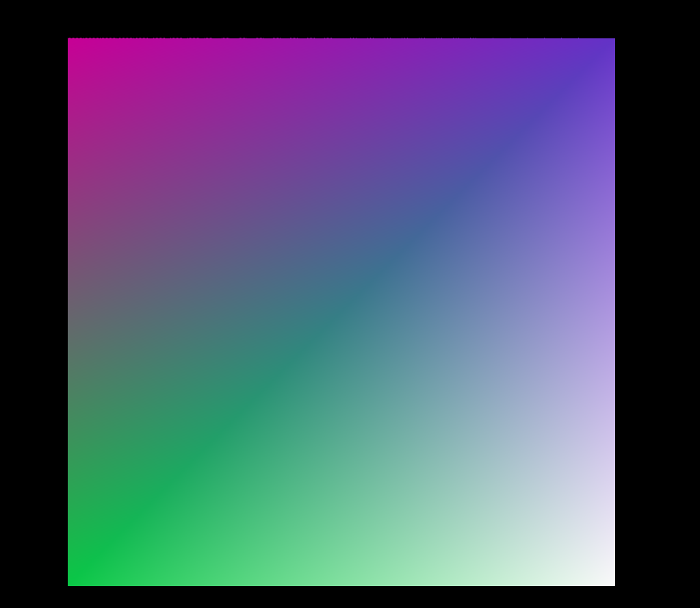

# GraphicCollection

---

## Triangle Rasterization

### Line

Line draw by Bresenham Line-Drawing Algorithm

### Triangle
Draw triangle with gouraud interpolation. Dealing with  transparent  triangles edges.

### super sampling

but it seems get some error about super sampling.

---